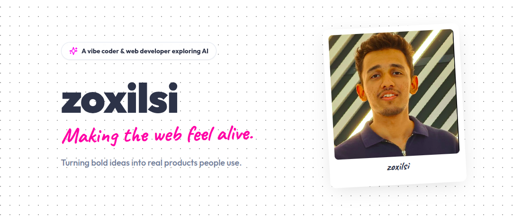

<br />
<div align="center">

  

  <h2>Zoxilsi.cc Portfolio Source Code</h2>
  
  <p align="center">
    A minimalistic, high-performance web portfolio built with modern tools to make the web feel alive.
    <br />
    <br />
    <a href="https://github.com/zoxilsi">
      
    </a>
    <a href="https://linkedin.com/in/zoxilsi">
      
    </a>
    <a href="https://zoxilsi.cc">
      
    </a>
  </p>
  
  <p align="center">
    <strong>If you like what you see or borrowed some inspiration, consider dropping a star!</strong> 
    <br />
    <a href="https://github.com/zoxilsi/zoxilsi.cc">
      
    </a>
  </p>

</div>

---

<br />

### Technology Stack

<p align="center">
  
  
  
  
  
</p>

### Want to build a portfolio like this?

Feel free to fork this project to use as a base for your own personal website! Just be sure to customize the content, links, and styling to make it uniquely yours. The codebase is heavily modularized, making it simple to tweak the design system in `tailwind.config.js` and structure in `App.tsx`.

If you do use it, **a star on this repository and a small credit** at the bottom of your site would be highly appreciated!

### Usage & Setup

Local installation is fast and easy:

1. **Clone the repository:**
   ```sh
   git clone https://github.com/zoxilsi/zoxilsi.cc.git
   ```

2. **Navigate into the folder:**
   ```sh
   cd zoxilsi.cc
   ```

3. **Install the dependencies:**
   ```sh
   npm install
   ```

4. **Spin up your local development server:**
   ```sh
   npm run dev
   ```

### Architecture & Deployment

This application is built as a static frontend. Node.js is exclusively utilized locally to power Vite and process Tailwind CSS styling. 

When you run `npm run build`, everything compiles down into optimized vanilla HTML/CSS/JS. It's ready to be seamlessly deployed via platforms like **Vercel** or **Netlify** with zero backend infrastructure required.

<br />
<div align="center">
  Built with dedication to turning bold ideas into real products people use.
</div>
